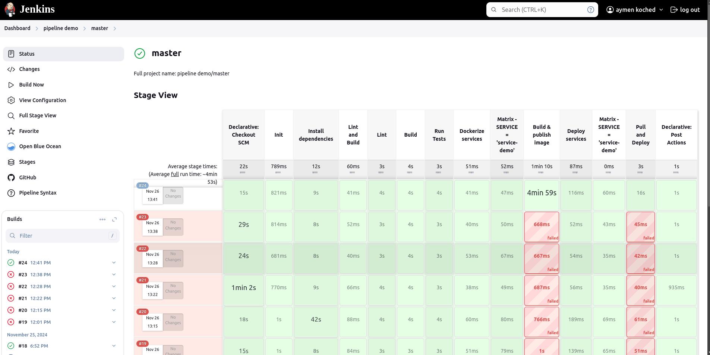

# Pipeline Demo

This repository demonstrates a Jenkins pipeline for building and deploying services using Docker Compose and Yarn workspaces.

## Prerequisites

Before using this repository, ensure that you have the following tools and dependencies installed:

1. **Docker**: Ensure Docker is installed and running on your local machine to build and deploy Docker images.

   - [Install Docker](https://docs.docker.com/get-docker/)

2. **Docker Compose**: Required to manage multi-container Docker applications.

   - [Install Docker Compose](https://docs.docker.com/compose/install/)

3. **Node.js**: Make sure Node.js is installed (version 18 or higher is recommended).

   - [Install Node.js](https://nodejs.org/)

4. **Yarn**: This project uses Yarn for managing dependencies and running scripts.

   - [Install Yarn](https://classic.yarnpkg.com/en/docs/install/)

5. **Jenkins**: Jenkins is used to automate the pipeline for building and deploying services.

   - [Install Jenkins](https://www.jenkins.io/doc/book/installing/)

6. **Jenkins Agent with Node.js**: The Jenkins agent must have Node.js installed and be labeled as `nodejs-agent` for the pipeline to work.

7. **Docker Hub Account**: A Docker Hub account is required for pushing and pulling images from Docker Hub.

   - [Sign up for Docker Hub](https://hub.docker.com/signup)

8. **Git**: Git is used for version control and pulling the repository.
   - [Install Git](https://git-scm.com/book/en/v2/Getting-Started-Installing-Git)

## I. Dockerfile for Service Build

The `Dockerfile` builds a Docker image for a specified service through a multi-stage process:

### Stages of the Dockerfile

1. **Base Stage**:

   - Starts with the `node:18.12.1-bullseye-slim` image.
   - Installs necessary system dependencies (`ca-certificates`, `curl`).
   - Sets the working directory to `/app/current`.

2. **Installer Stage**:

   - Installs additional build dependencies (`python3`, `make`, `g++`).
   - Accepts a `SERVICE` build argument to specify which service to build.
   - Copies relevant files from the selected service directory into the container.
   - Uses Yarn Workspaces to install dependencies for the service.
   - Compresses the `node_modules` directory into a tarball for easy transfer between build stages.

3. **Builder Stage**:

   - Installs dependencies and builds the service using Yarn.
   - Outputs the built service into the `/dist` directory.

4. **Final Stage**:
   - Creates a minimal image with the necessary files for the service to run.
   - Copies the `node_modules` tarball from the installer stage, extracts it, and prepares the final image.
   - Sets the user to `node` to ensure the application runs with non-privileged access.
   - Exposes port 3000 and defines the entry point for the application.

The final image can be used to run the service in a Docker container.

### Example Build Command:

To build a specific service (e.g., `service-demo`), use the following command:

```bash
  docker build --build-arg SERVICE=service-demo -t service-demo-image:latest .
```

## II. Jenkins Pipeline for CI/CD

The pipeline automates building, testing, Dockerizing, and deploying services. It uses a matrix to run multiple services in parallel.

### Pipeline Stages

1. **Init**:
   Initializes environment variables and determines the branch (`master` sets `IS_MASTER=true`).

2. **Install Dependencies**:
   Installs dependencies using `yarn install --immutable`.

3. **Lint and Build**:
   Runs `yarn lint` and `yarn build` in parallel.

4**Run Tests**:
Executes `yarn test` to run all defined tests and ensure the code is functioning as expected.

5. **Dockerize Services**:

   - **Matrix**: The pipeline uses a matrix configuration to build and deploy multiple services concurrently. The `SERVICE` axis specifies the services to be built (e.g., `service-demo`).
   - The pipeline builds a Docker image for each service using the `docker build` command. The `--build-arg SERVICE` option passes the service name to the Dockerfile, and the image is tagged with the service name and build number.

   **Build and Publish Docker Image**:

   ```bash
    docker build --build-arg SERVICE=${SERVICE} -t ${DOCKER_IMAGE}:${SERVICE}-${BUILD_NUMBER} .
    echo ${DOCKER_HUB_CREDENTIALS_PSW} | docker login -u ${DOCKER_HUB_CREDENTIALS_USR} --password-stdin
     docker push ${DOCKER_IMAGE}:${SERVICE}-${BUILD_NUMBER}
     docker logout
   ```

6. **Deploy Services**:

   - This stage only runs when the branch is `master`, using the `when` condition.
   - **Matrix**: Similar to the Dockerize stage, the deploy stage uses a matrix to deploy each service defined by the `SERVICE` axis.
   - The pipeline pulls the Docker image, stops and removes any existing containers, and runs a new container with the updated image.

   **Deploy to Local Docker**:

   ```bash
    docker pull ${DOCKER_IMAGE}:${SERVICE}-${BUILD_NUMBER}
    docker stop ${SERVICE}-container || true
    docker rm ${SERVICE}-container || true
    docker run -d --name ${SERVICE}-container --network ${DOCKER_NETWORK_NAME} -e IS_DOCKER=true -p 3000:3000 ${DOCKER_IMAGE}:${SERVICE}-${BUILD_NUMBER}
   ```

**Post-Cleanup**:
After all pipeline stages are executed, the pipeline performs a cleanup by removing temporary files and directories to maintain a clean workspace. - **Matrix**: Similar to the Dockerize stage, the deploy stage uses a matrix to deploy each service defined by the `SERVICE` axis.

```bash
  deleteDir()
```

### Jenkins Build Screenshot

Here is a screenshot of the Jenkins build process for this project:



## III. Root Directory

### 1. Available Scripts

In the root directory, the following scripts are available for managing the project and running various tasks:

- **`preinstall`**:
  Runs `husky install` to set up Git hooks before dependencies are installed.

- **`commit`**:
  Runs `git-cz` to start the Commitizen CLI for conventional commit formatting.

- **`lint:fix`**:
  Lints and fixes code across all workspaces using ESLint, running the `lint:fix` script in each workspace. It is run in parallel across the workspaces.

- **`lint`**:
  Runs ESLint across all workspaces to identify and fix code issues. It is executed in parallel across the workspaces.

- **`build`**:
  Runs the `build` script in all workspaces to build the respective services. This is run in parallel with job concurrency managed by Yarn workspaces.

- **`test`**:
  Runs the `test` script in each workspace to execute unit tests for each service. Parallel execution ensures faster runs across the services.

- **`stack:up`**:
  Brings up the Docker containers defined in `docker-compose.yml` for the entire application stack in detached mode.

- **`stack:down`**:
  Shuts down the Docker containers, stopping and removing the services defined in `docker-compose.yml`.

### 2. Workspaces

This project uses Yarn workspaces to manage multiple services located in the `services/*` directory. Each service is treated as a separate package and can have its own dependencies and scripts.

## IV. Service Demo

This directory demonstrates a simple service built with Node.js, using Webpack and Babel for bundling, Jest for testing, and ESLint/Prettier for code quality.

### 1. Available Scripts

In the `service-demo` directory, the following scripts are available for managing the service:

- **`dev`**:
  Runs the service in development mode using `nodemon`, which watches for file changes and automatically restarts the server.

- **`build`**:
  Cleans up the `dist` directory using `rimraf` and then compiles the source code in `src` using Babel, outputting the result to the `dist` directory. The `--copy-files` option ensures non-JS files are also copied over.

- **`build:webpack`**:
  Similar to `build`, but this script uses Webpack for bundling the source code, running in production mode for optimized output.

- **`format`**:
  Runs Prettier to format all JavaScript files in the `src` directory.

- **`start`**:
  Starts the service by executing the `main.js` file in the `dist` directory, which contains the transpiled code from Babel or Webpack.

- **`lint`**:
  Lints the JavaScript files across the project (in `src`, `apps`, `libs`, and `test` directories) using ESLint.

- **`lint:fix`**:
  Similar to `lint`, but automatically fixes any issues ESLint can resolve.

- **`test`**:
  Runs tests using Jest.

- **`test:watch`**:
  Runs Jest in watch mode, where tests are re-run automatically when file changes are detected.

- **`test:cov`**:
  Runs tests and generates a coverage report.

- **`test:debug`**:
  Runs Jest in debug mode, which opens a debugging session using the Node.js inspector.

- **`test:e2e`**:
  Runs end-to-end tests using a custom Jest configuration file (`jest-e2e.json`).

### 2. Build Types

There are two types of builds available for the `service-demo` project:

1. **Babel Build** (`build`):

   - Transpiles the source code in `src` using Babel and outputs the result to the `dist` directory.
   - The build is optimized for running in Node.js but does not bundle all dependencies.
   - The `rimraf` command ensures that the `dist` directory is cleaned up before rebuilding.

2. **Webpack Build** (`build:webpack`):
   - Bundles the application using Webpack for production.
   - Uses `webpack-node-externals` to exclude dependencies from the bundle that are installed in `node_modules` and will be available during runtime.
   - The build output is also placed in the `dist` directory.
   - This build is optimized for deployment and includes all necessary JavaScript files for running the service.
